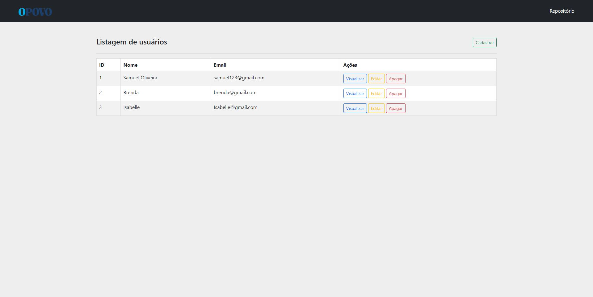
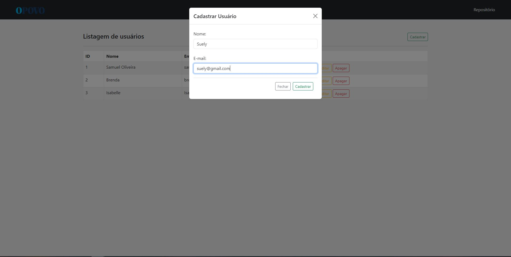
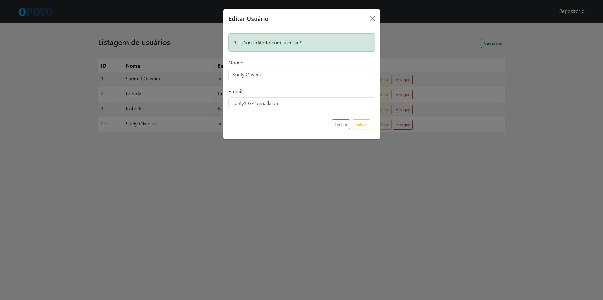

<h1 align="center"> CRUD OPOVO </h1>
Projeto prático de back-end, para se tornar aprendiz do Grupo de Comunicação O POVO. Este projeto mesmo com os conhecimento que eu já tenho dessas tecnologias, me trouxe muitos conhecimentos e experiências que com certeza continuarei aprimorando para a minha vida profissional.

  <a href="#-tecnologias">Tecnologias</a>&nbsp;&nbsp;&nbsp;|&nbsp;&nbsp;&nbsp;
  <a href="#-projeto">Projeto</a>&nbsp;&nbsp;

 

  
  
  

## 🚀 Tecnologias

Esse projeto foi desenvolvido com as seguintes tecnologias:

- PHP
- MYSQL
- JavaScript
- Bootstrap
- HTML, CSS
- Github

## 💻 Projeto

No projeto criei as 4 operações básicas conhecidas como CRUD (CREATE, READ, UPDATE, DELETE), possibilitando o cadastro de novos usuários, a visualização de seus dados, edição de seus dados e apaga-los, tudo em apenas uma tela com conexão direta ao banco de dados MYSQL. O que utilizei no código?

- Conexão com Banco de Dados
- Manipulação de Dados em PHP
- Integração com Bootstrap
- Uso de Promises e Async/Await
- Manipulação de JSON
- Depuração de Código

---

Feito com ♥ by Samuel Oliveira.
